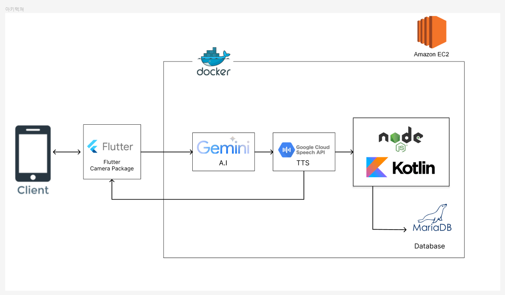
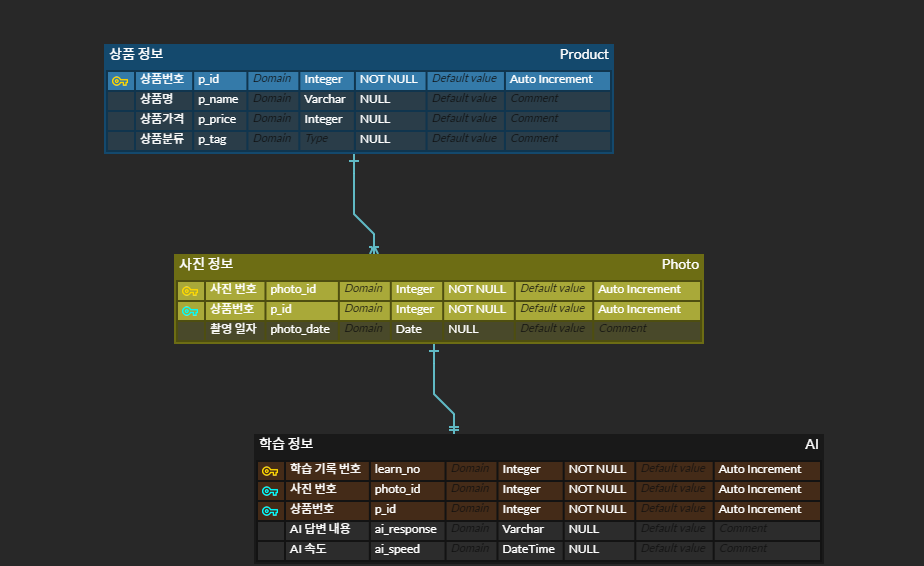

# Flutter_Gemini
> 시각장애인의 오프라인 쇼핑을 보조하는 AI를 활용한 어플리케이션 개발

***

## :bookmark_tabs: 사용 api 및 Gradle 버전

**flutter_gemini** - v2.0.3
**flutter_tts** - v4.0.2
**flutter_camera**
~~~
//pubspec.yaml
  camera:
    git:
      url: https://github.com/flutter/plugins
      path: packages/camera/camera
      ref: 9e46048ad2e1f085c1e8f6c77391fa52025e681f
~~~

**Gradle 버전** - v7.6.3
***

## :mag: Architecture

***
## :floppy_disk: Database

ERD

***